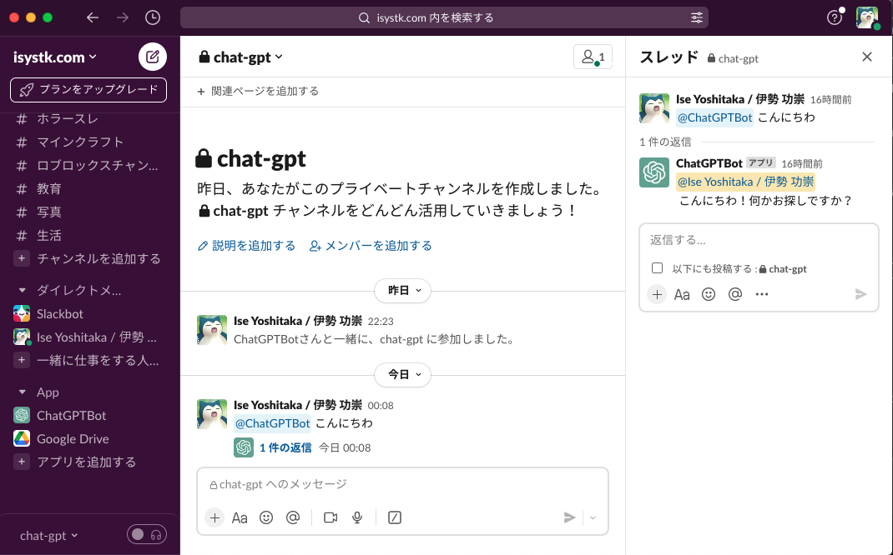
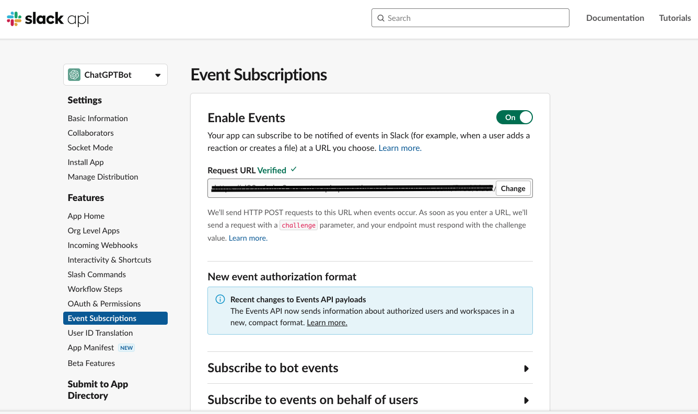

🌙 lambda-slackbolt-openai
====


## 📗 プロジェクトの概要

Slackから「＠ChatGPTBot こんにちわ」のようにメンションをつけて投稿すると
ChatGPTがスレッドに返信してくれるアプリケーションです。
AWS-Lambdaで動作しています。SAMを利用して自動デプロイ可能です。
ローカル環境では、Slack側からAPIアクセスが出来ないのでソケットモードで接続するようにしています。

## 🌐 Demo



## 📦 ディレクトリ構造

```
.
├── README.md
├── app (Lambdaのモジュール)
│   ├── dist
│   ├── jest.config.ts
│   ├── node_modules
│   ├── package-lock.json
│   ├── package.json
│   ├── src
│   ├── tests
│   └── tsconfig.json
├── layers (共通モジュール)
│   └── app-layer
├── samconfig.toml
├── task
│   ├── env.json
│   └── env.json.example
└── template.yaml
```

## 🔧 開発環境の構築

IAM ユーザーを用意する
```
ユーザ名：「lambda-user」
アクセス権限：
「AdministratorAccess」
```

SAM CLI をインストールする
```
$ pip install aws-sam-cli
```

AWSにアクセスする為の設定を作成する
```
$ aws configure --profile lambda-user 
AWS Access Key ID [None]: xxxxxxxxxx
AWS Secret Access Key [None]: xxxxxxxxxx
Default region name [None]: ap-northeast-1
Default output format [None]: json
```

Slackアプリを作成する

https://api.slack.com/apps

OAuth & Permissions から Required Scope の設定
| 設定値 | 概要 |
|:----------------| :-------------------------------|
| app_mentions:read | botが参加しているチャンネル内で@ChatGPTBotに直接言及したメッセージを取得する |
| channels:history | botが参加しているパブリックチャンネルのメッセージを閲覧できる |
| channels:join | パブリックチェンネルに参加できる |
| chat:write | botがメッセージを書き込むことができる |
| groups:history | botが参加しているプライベートチャンネルのメッセージを閲覧できる |
| im:history | botが参加しているDMのメッセージを閲覧できる |

Event Subscriptions から Subscribe to bot events の設定
| 設定値 | 概要 |
|:----------------| :-------------------------------|
| message.im | DM内でメッセージを送った際のイベント |
| message.groups | プライベートチャンネル内でメッセージを送った際のイベント |
| message.channels | パブリックチャンネル内でメッセージを送った際のイベント |
| ~~app_mention~~ | メンション付きでメッセージを送った際のイベント |



※ ローカルで動かしたい場合は、「Enable Socket Mode」を有効にしてください。

## 💬 使い方

ローカルでAPIを起動する
```
# cd app
$ npm install
$ npm run start
```

AWS にデプロイする
```
# ESModuleでビルドできるようにする
$ npm install -g esbuild 
# ビルドを実行する（.aws-samディレクトリに生成される）
$ sam build
# AWSに反映する
$ sam deploy --config-env stg

# AWSから、Lambda&APIGatewayを削除する
$ sam delete --stack-name lambda-slackbolt-openai --profile lambda-user
```

## 🎨 参考

| プロジェクト| 概要|
| :---------------------------------------| :-------------------------------|
| [ChatGPT (OpenAI) を AWS Lambda / Slack 上で動かす](https://blog.nekohack.me/posts/chatgpt-slack)| ChatGPT (OpenAI) を AWS Lambda / Slack 上で動かす |
| [【30分で完成】オウム返しBotから始めるSlackアプリの作り方](https://www.pci-sol.com/business/service/product/blog/lets-make-slack-app/)| 【30分で完成】オウム返しBotから始めるSlackアプリの作り方 |


## 🎫 Licence

[MIT](https://github.com/isystk/lambda-slackbolt-openai/blob/master/LICENSE)

## 👀 Author

[isystk](https://github.com/isystk)
